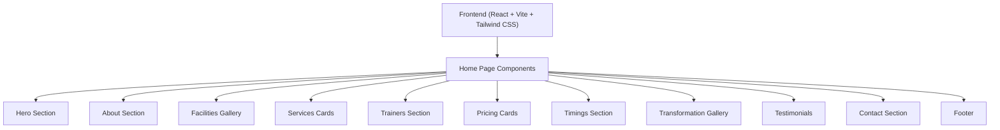

## 1. Architecture Design



## 2. Technology Description
- **Frontend**: React@18 + Tailwind CSS@3 + Vite
- **Initialization Tool**: Vite (npm create vite@latest)
- **Backend**: None (static website)
- **Database**: None (mock data for demo)

## 3. Route Definitions
| Route | Purpose |
|-------|---------|
| / | Home page with all sections |

## 4. File Structure
```
/
├── public/
│   └── images/          # User-provided gym images
├── src/
│   ├── components/      # Reusable UI components
│   ├── sections/        # Page sections
│   ├── App.jsx          # Main app component
│   ├── main.jsx         # Entry point
│   └── index.css        # Global styles
├── package.json
├── vite.config.js
└── tailwind.config.js
```
