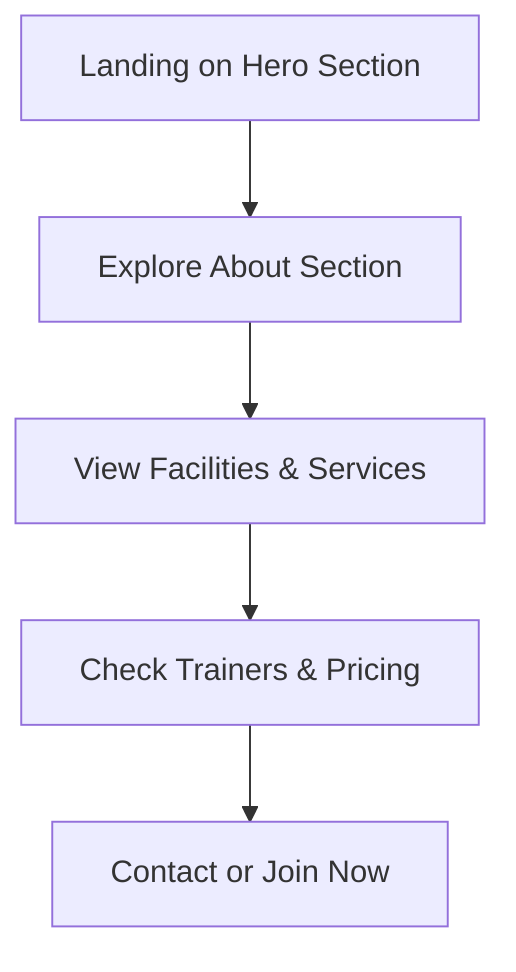

## 1. Product Overview
A premium, modern, high-converting gym website for Fitness Theater, showcasing state-of-the-art facilities, expert trainers, and membership plans to attract a diverse audience.

## 2. Core Features

### 2.2 Feature Module
1. **Home page**: hero section, about section, facilities gallery, services cards, trainers section, pricing, timings, transformation gallery, testimonials, contact section, footer
2. **Navigation**: smooth scrolling between sections

### 2.3 Page Details
| Page Name | Module Name | Feature description |
|-----------|-------------|---------------------|
| Home page | Hero section | Full-screen banner with headline, subheadline, and two CTA buttons |
| Home page | About Fitness Theater | Introduce gym's key highlights |
| Home page | Facilities & Equipment | Image gallery showcasing gym facilities |
| Home page | Services | Premium service cards for various fitness programs |
| Home page | Trainers Section | Trainer profiles with photo, name, specialization, experience |
| Home page | Membership Pricing | Pricing cards with highlighted popular plan |
| Home page | Gym Timings | Professional schedule display |
| Home page | Transformation Gallery | Before/after image gallery |
| Home page | Testimonials | Member review cards |
| Home page | Contact Section | Gym contact info, Google Maps embed, and contact buttons |
| Home page | Footer | Navigation links, social media, copyright |

## 3. Core Process
Users land on hero section, explore gym info, view facilities/services, check trainers/pricing, and contact/join.

## 4. User Interface Design

### 4.1 Design Style
- **Primary color**: Red (#E11D2E)
- **Secondary color**: Black (#0A0A0A)
- **Accent color**: Dark Gray (#1A1A1A)
- **Text color**: White (#FFFFFF)
- **Typography**: Headings - Bebas Neue or Oswald; Body - Inter
- **Buttons**: Bold, with hover effects and red glowing accents
- **Layout**: Modern card-based sections with generous spacing
- **Animations**: Smooth scrolling, fade-in effects, hover animations, image zoom, number counters

### 4.2 Page Design Overview
| Page Name | Module Name | UI Elements |
|-----------|-------------|-------------|
| Home page | Hero section | Full-screen background, large bold headings, dual CTA buttons with hover animations |
| Home page | Facilities & Equipment | Grid-based image gallery with zoom on hover |
| Home page | Services Cards | Dark backgrounds with red accents, hover elevation effects |
| Home page | Pricing Cards | Three tiers with highlighted popular plan, animated hover effects |
| Home page | Contact Section | Google Maps embed, contact info with icons, CTA buttons |

### 4.3 Responsiveness
Desktop-first design, fully responsive for mobile and tablet devices with touch-optimized interactions.
